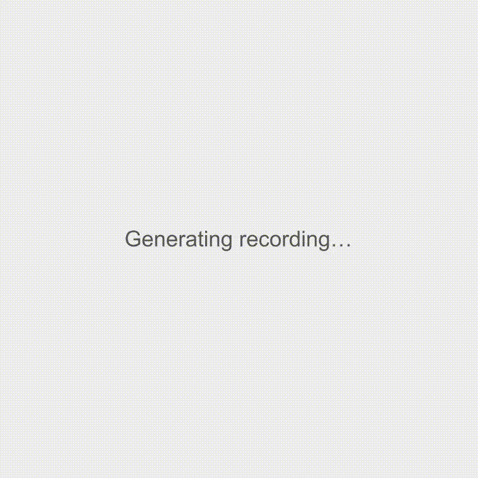

# Streamline

A YouTube downloader with two modes: a clean, minimalist interface for casual users, and a powerful command builder for those who want full control over yt-dlp options.

 

## Demo



| Curator Mode | Terminal Mode |
|--------------|---------------|
| Clean, simple interface for quick downloads | Full command builder with 45+ yt-dlp options |
| Video or Audio format selection | Quality, subtitles, post-processing controls |
| One-click download | Live command preview |

## Features

- **Two UI Modes**
  - **Curator Mode**: Simple, clean interface. Paste a URL, pick video or audio, hit download.
  - **Terminal Mode**: Full command builder with 45+ yt-dlp flags organized in categories.

- **Folder Picker**: Choose where to save downloads (Downloads, Desktop, Documents, etc.) from a dropdown—no need to type paths.

- **Real-time Progress**: Live streaming of yt-dlp output so you can see exactly what's happening.

- **Auto-Install Dependencies**: First-time setup wizard that can install yt-dlp and ffmpeg automatically via brew/pip.

- **Cancel Downloads**: Stop any download mid-way if needed.

- **Output Templates**: Customize filenames with yt-dlp variables. Includes presets for common patterns.

- **Persistent Settings**: Your download location and preferences are saved between sessions.

## Prerequisites

- **Node.js** (v18+)
- **yt-dlp** - The app can install this for you, or run `brew install yt-dlp`
- **ffmpeg** (optional) - For audio extraction and format conversion

## Quick Start

### 1. Clone the repo

```bash
git clone git@github.com:Olayanju-1234/streamline.git
cd streamline
```

### 2. Install dependencies

```bash
# Server
cd server && npm install

# Client
cd ../client && npm install
```

### 3. Run the app

Open two terminal windows:

```bash
# Terminal 1 - Start the server
cd server && npm run dev

# Terminal 2 - Start the client
cd client && npm run dev
```

### 4. Open in browser

Go to [http://localhost:3000](http://localhost:3000)

If yt-dlp isn't installed, you'll see a setup wizard that can install it for you.

## Project Structure

```
streamline/
├── client/                 # React frontend (Vite + TypeScript)
│   ├── src/
│   │   ├── components/     # UI components (CuratorMode, TerminalMode, etc.)
│   │   ├── hooks/          # Custom React hooks
│   │   ├── store/          # Zustand state management
│   │   ├── services/       # Socket.io client
│   │   ├── constants/      # yt-dlp flags, templates
│   │   └── config/         # Environment config
│   └── package.json
│
├── server/                 # Express + Socket.io backend
│   ├── src/
│   │   └── index.ts        # Server entry point
│   └── package.json
│
└── README.md
```

## Configuration

### Environment Variables

Create `.env` files based on the examples:

**Server (`server/.env`)**
```
PORT=3001
CORS_ORIGIN=http://localhost:3000
DOWNLOAD_PATH=/path/to/downloads
```

**Client (`client/.env`)**
```
VITE_API_URL=http://localhost:3001/api
VITE_SOCKET_URL=http://localhost:3001
```

## Usage

### Curator Mode

1. Paste a YouTube URL
2. Select format (Video or Audio)
3. Click Download

### Terminal Mode

1. Paste a YouTube URL
2. Click categories to expand them (Format, Quality, Subtitles, etc.)
3. Toggle the flags you want
4. See the live command preview
5. Click Download

### Changing Download Location

1. Click the gear icon (⚙️) in the header
2. Select a folder from the dropdown
3. Downloads will save to that location

## Available yt-dlp Options

Terminal Mode includes 45+ flags organized into categories:

| Category | Options |
|----------|---------|
| **Format** | Best Video+Audio, Extract Audio, Convert to MP4/WebM |
| **Quality** | Best, Lowest, Max 1080p / 720p / 480p |
| **Subtitles** | Download Subs, Embed, Auto-generated, All Languages |
| **Post-Processing** | Merge formats, Embed Thumbnail/Metadata, Split by Chapters |
| **Filesystem** | No Overwrites, Resume Downloads, Single Video / Playlist |
| **Network** | Rate Limiting, Retries, Geo Bypass |
| **Auth** | Browser Cookies (Chrome/Firefox/Safari) |

## Tech Stack

- **Frontend**: React, TypeScript, Vite, Tailwind CSS, Zustand
- **Backend**: Node.js, Express, Socket.io
- **Download Engine**: yt-dlp

## Development

```bash
# Run both client and server in dev mode
cd client && npm run dev
cd server && npm run dev
```

The client runs on port 3000, server on port 3001. Hot reload is enabled for both.

## Troubleshooting

**"yt-dlp not found"**
- Run `brew install yt-dlp` or `pip install yt-dlp`
- Or use the auto-install feature in the setup wizard

**Downloads failing**
- Make sure yt-dlp is up to date: `yt-dlp -U`
- Check that the URL is a valid YouTube link

**"Permission denied" when downloading**
- The download folder might not be writable
- Try selecting a different folder in settings

## License

MIT

## Contributing

PRs welcome. For major changes, open an issue first to discuss.
